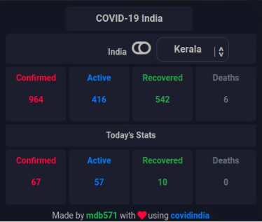
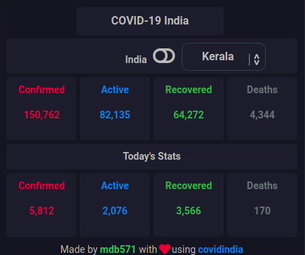

<h1 align="center">CovidTrack India</h1>

Browser extension to get live updates on covid-19 based on <a href="https://covid19india.org">covid19india</a>

  

<h3 align="center">Made by <a href="https://github.com/mdb571">@mdb571⚡</a></h3>

## Features

- Based on [covid19india](https://api.covid19india.org/) dark mode
- Cross Browser Support
- Free and Open Source
- Uses [covid19india](https://api.covid19india.org/) API

## Usage
  - ### Firefox
    - Load the Add-on via `about:debugging` as temporary Add-on.
    - Choose the manifest.json file in the extracted directory

 - ### Chrome
    - Go to the browser address bar and type `chrome://extensions`
    - Check the `Developer Mode` button to enable it.
    - Click on the `Load Unpacked Extension` button.
    - Select your extension’s extracted directory.
  
## Screenshots

  

 

  

## Note

This is my first time making a browser extension so you will feel slight bugs here and there while using it.I'll try to update as I learn on the go.. 

## Contributing and Support

Feel free to open a pull request if you can help in improving this project.

## Thanks

This project would'nt have been successful without using [web-extension-starter](https://github.com/abhijithvijayan/web-extension-starter) made by [abhijithvijayan](https://github.com/abhijithvijayan).So kudos to this awesome developer⚡🎉

## Show your support

Give a ⭐️ if this project helped you!❤️

## Licence

Code released under the [MIT License](LICENSE).
